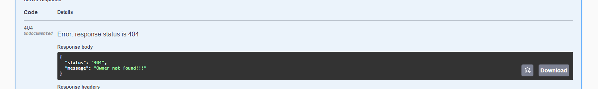

# Github Repository

This project is a Spring Boot application that provides an API to fetch GitHub repositories and their branches for a specified user.

## Features

- Fetches all non-fork repositories for a given GitHub username.
- Fetches branches for each repository.

## Technologies Used

- Java 21
- Spring Boot
- Maven
- Swagger

## Getting Started

### Prerequisites

- Java
- Maven
- Git

### Installation

1. Clone the repository:

   ```bash
   git clone https://github.com/yourusername/github-repository-service.git
### Swagger ui used for easier search:

### Successful response:

### Error message when owner has not been found:


